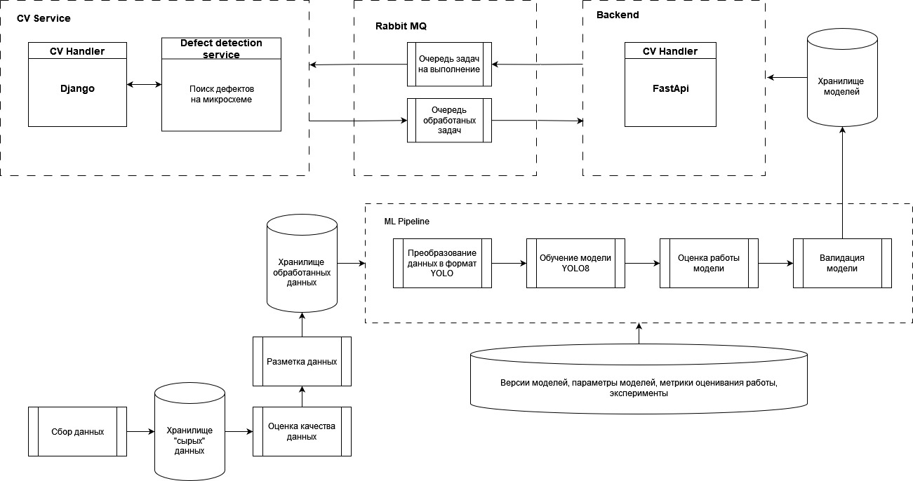

# Project for finding defects on electronic circuit boards
Our program recognizes 6 defects on printed circuit boards such as:
1. Missing hole
2. Mouse bite
3. Open circuit
4. Short
5. Spur
6. Spurious copper

## Contents
- [Technologies](#technologies)
- [System Requirements](#system-requirements)
- [Architecture](#architecture)
- [Deploy](#deploy)
- [Program Demonstration](#demonstration-of-the-program-operation)
- [Limitations](#limitations)
- [Success Metrics](#success-metrics)
- [Contributing](#contributing)
- [FAQ](#faq)
- [Project Team](#project-team)
- [Links](#links)


### Technologies
- [YOLOv5](https://github.com/ultralytics/yolov5)
- [YOLOv8](https://github.com/ultralytics/ultralytics)
- [Django](https://www.djangoproject.com)
- [ClearML](https://clear.ml)

### System Requirements 
You will need ~10 GB of free disk space to deploy the container on your machine

### Architecture 



### Deploy
The system consists of three services: 

- Django - a web application that provides a way for the user to upload a picture of the chip
- RabbitMQ - as a task broker to organize a message queue between the model and the application
- Fast API - program interface for sending the results of the YOLO model work

Using Docker compose, the system can be started using the following steps:

- Clone the given repository
- Run docker on your machine
- ```sudo docker-compose build```
- ```sudo docker-compose up -d```.

⚠️ **disclaimer:** эта версия является тестовой, и выполняет задачу демонстрации итогов курса по компьютерному зрению.

### Demonstration of the program operation


### Limitations
The following things can be emphasized as limitations at the moment:
1. Frame rate per second - 4 (since the response time of the model is 200-250 ms).

### Success Metrics
As a business metric, we use the reduction in enterprise costs and board survey time by replacing controllers 
REA by the service being developed.

We used mAP50-95 (mean Average Precision in the range [.50: .05: .95]: 0.5 to 0.95 with a step size of 0.05 as the metric for evaluating the success of the experiments. The original goal was to achieve a value of at least 0.9, which was achieved in experiment 8 - we achieved mAP50-95 = 0.9289

### Contributing
If you would like to participate in the project development, give feedback or complain about errors - write to someone from the project team (below).

### FAQ
We will fill it in as errors occur while using the project.

### Project Team
- DE + ML + PM - Elizaveta Talynkova
- ML + Back-end - [Mulham Shahin](https://www.linkedin.com/in/mulham-shaheen-684352206/)
- DE + ML - [Sinyayev Vyacheslav](https://www.linkedin.com/in/vyacheslavsinyaev/) 

### Links
- Link to the original dataset - [here](https://www.dropbox.com/s/h0f39nyotddibsb/VOC_PCB.zip?dl=0)
- Description of the dataset on kaggle - [here](https://www.kaggle.com/datasets/sudharshann/pcb-defect-dataset)
- Link to the resulting dataset - [here](https://drive.google.com/drive/folders/1RbKRm6jYgw1rHkB8_KPg4Eu-Q_fVcrPc?usp=sharing)
