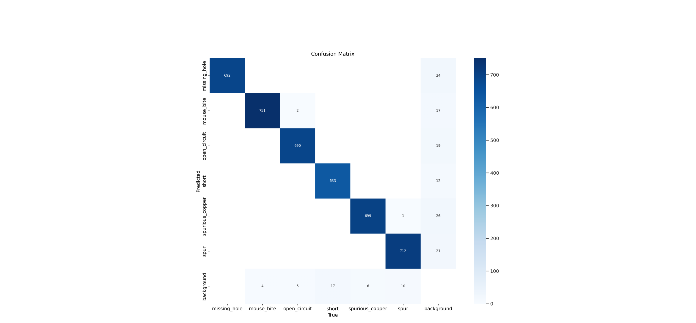
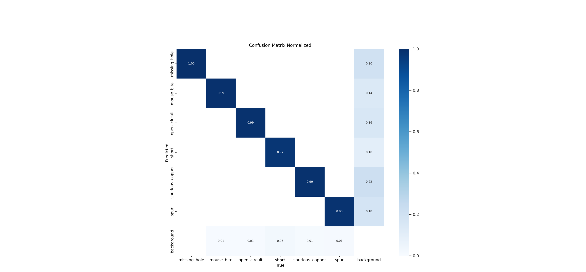
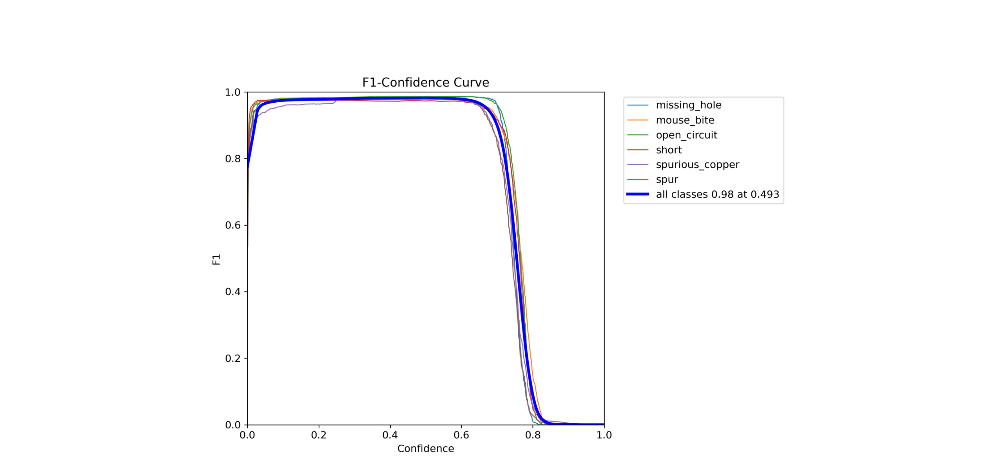
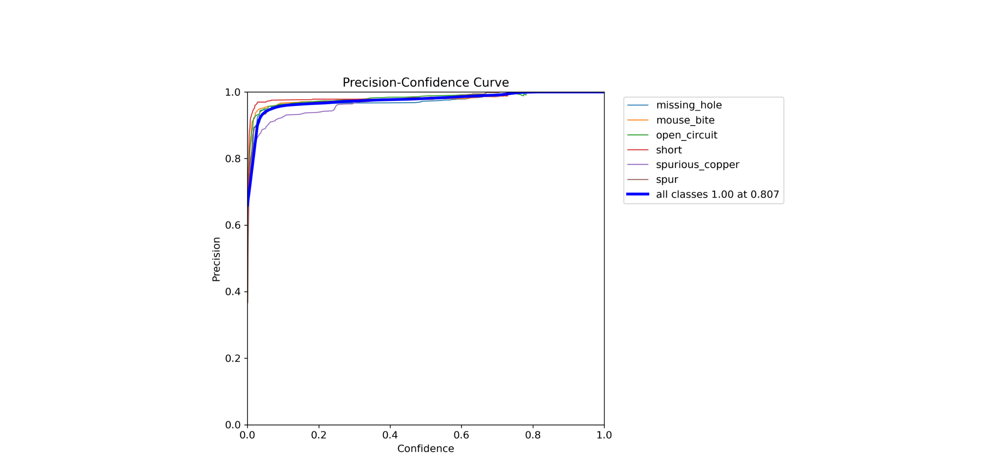
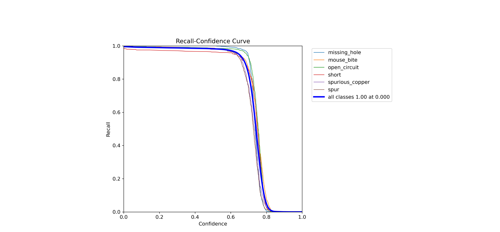
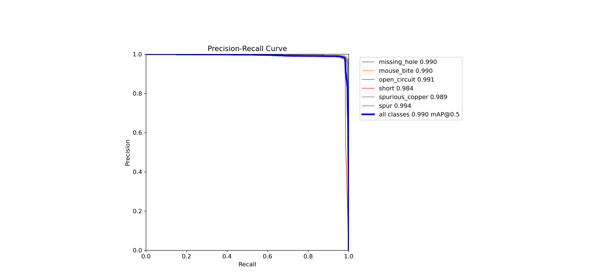
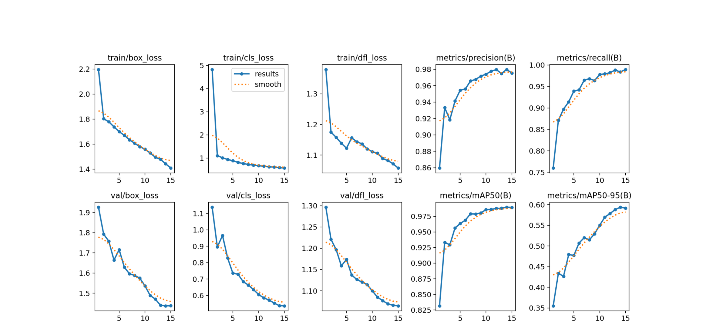

# Results of experiment 1

In this experiment, the YOLOv8s model was used.
Parameters set during training:
+ Number of epochs - 15
+ Batch size - 50
+ Image size - 640

[Link](https://app.clear.ml/projects/ad34b5d2036d44e7a0d10c6189ee8a59/experiments/9b6829f3ae5b48d5af484362af29d1e9/output/execution) to the experiment in ClearML.

The graphs are shown below as training evaluations:

