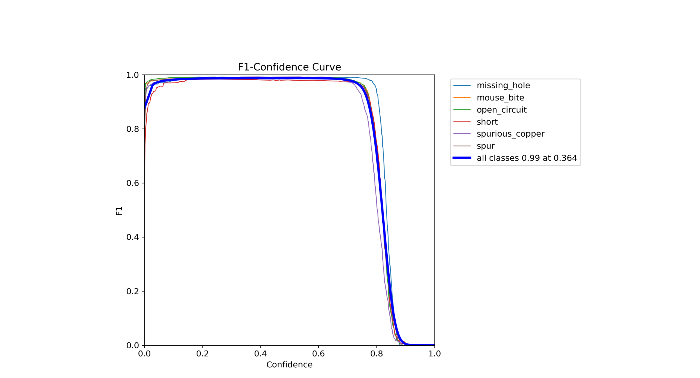
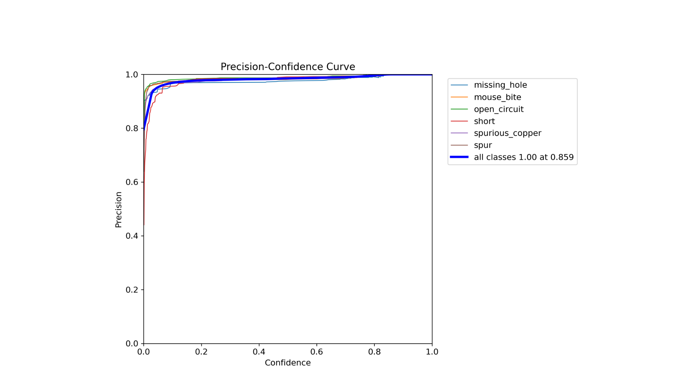
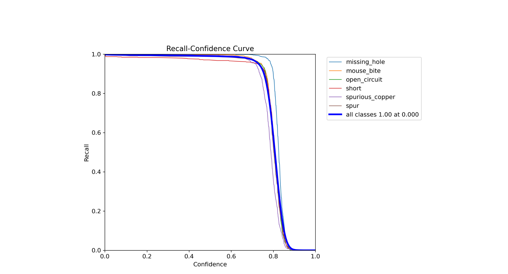
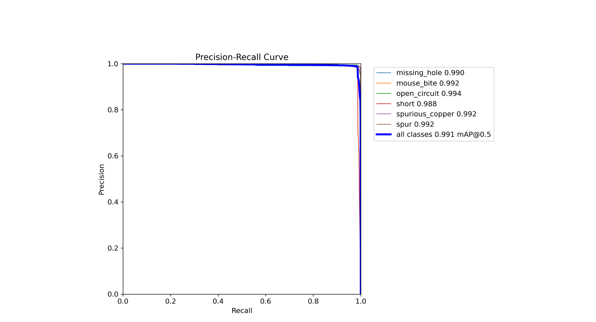
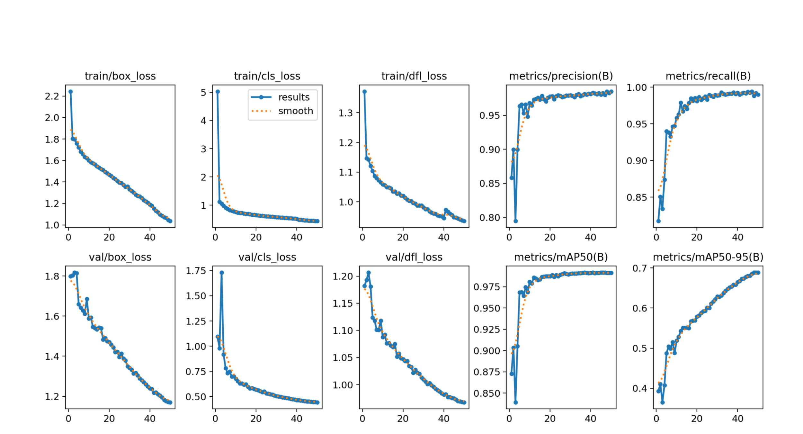

# Результаты эксперимента 2

В данном эксперименте использовалась модель YOLOv8s.
Параметры, заданные при обучении:
+  Количество эпох - 50
+  Размер батча - 50
+  Размер изображения - 608

Ниже в качестве оценок обучения приведены графики:

