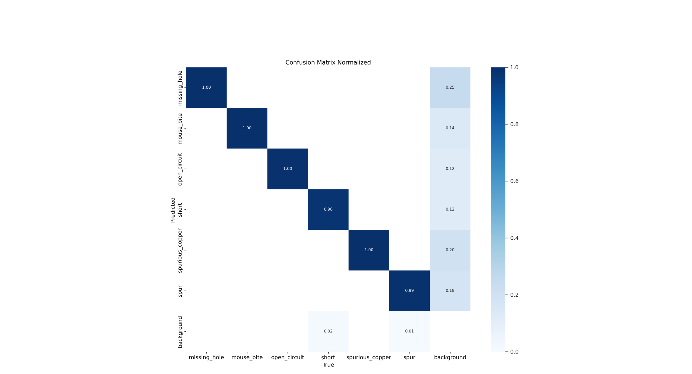

# Results of experiment 2

In this experiment, the YOLOv8s model was used.
Parameters set during training:
+ Number of epochs - 50
+ Batch size - 50
+ Image size - 608

[Link](https://app.clear.ml/projects/ad34b5d2036d44e7a0d10c6189ee8a59/experiments/deb0dd4fb57b415da4ca4c235180ab16/output/execution) to the experiment in ClearML.

The graphs are shown below as training evaluations:

