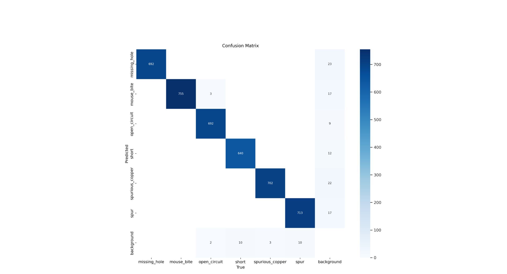
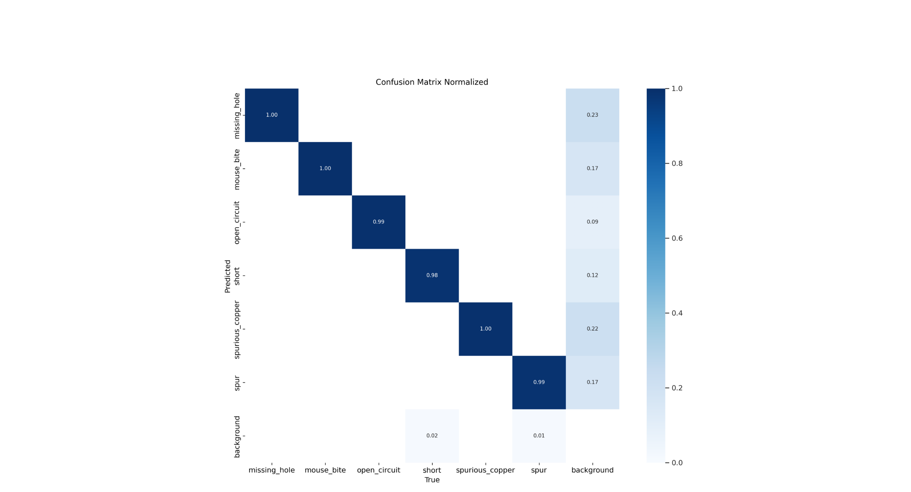
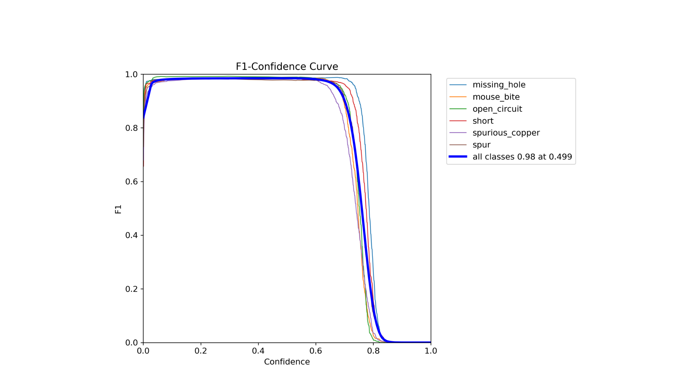
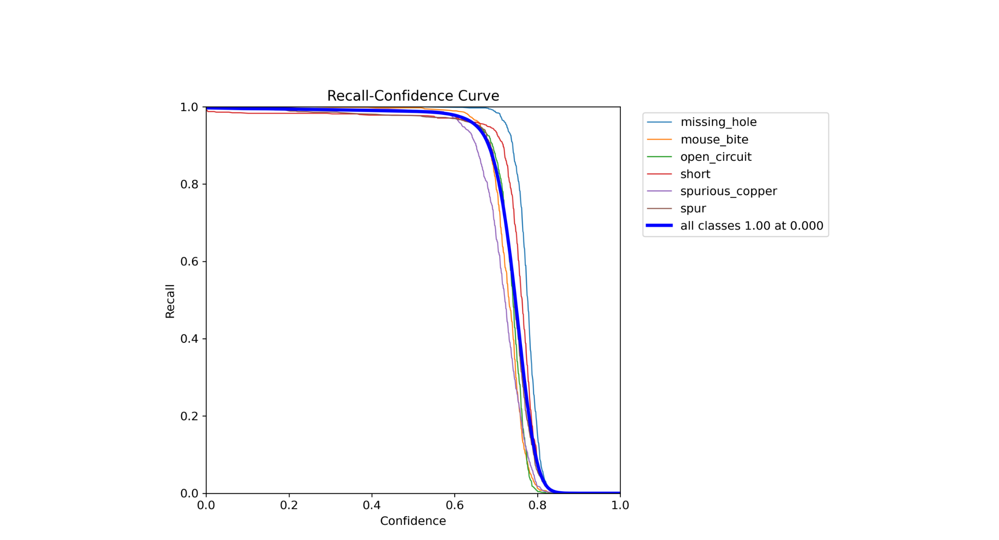
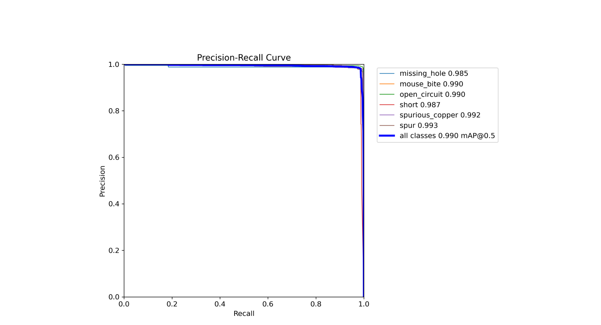
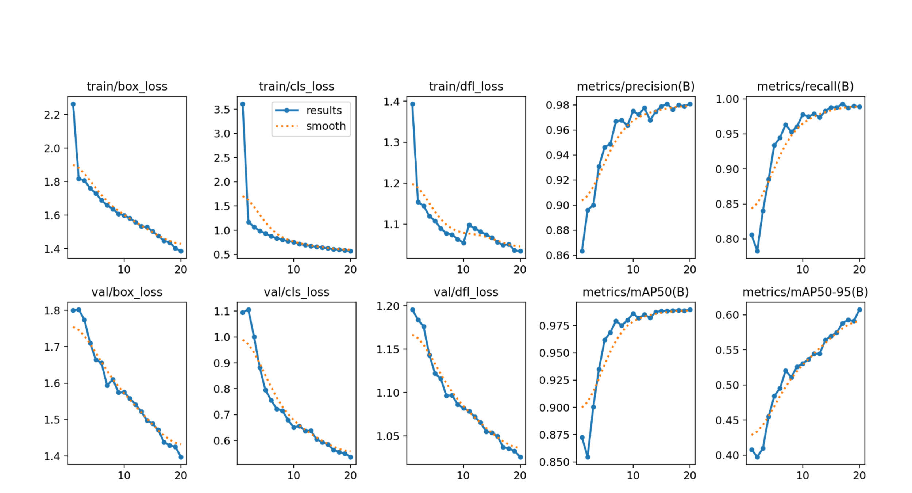

# Результаты эксперимента 3

В данном эксперименте использовалась модель YOLOv5s.
Параметры, заданные при обучении:
+  Количество эпох - 20
+  Размер батча - 50
+  Размер изображения - 608

Ниже в качестве оценок обучения приведены графики:

