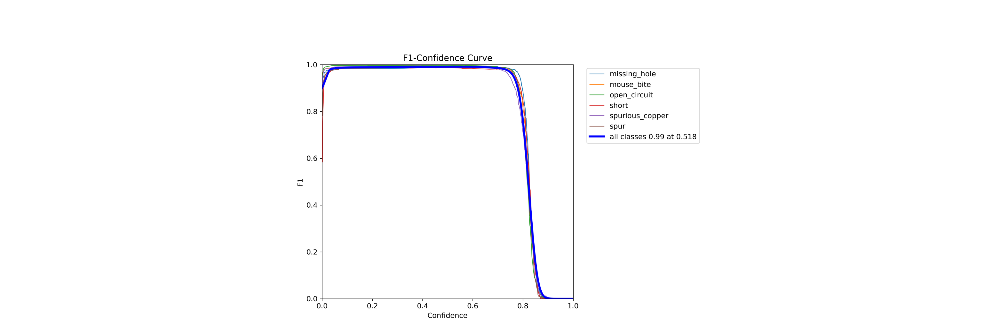
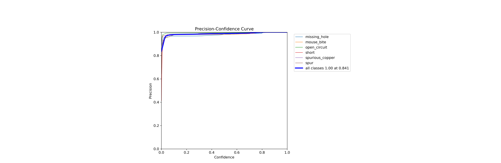
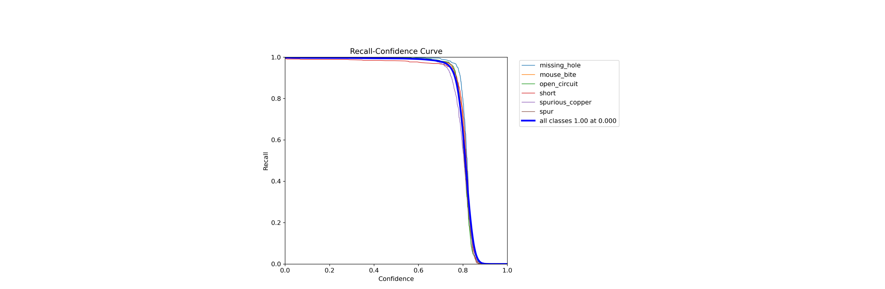
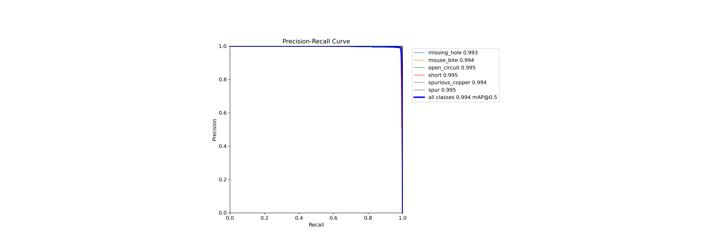
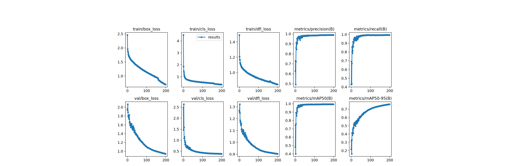

# Результаты эксперимента 5

В данном эксперименте использовалась модель YOLOv8n.
Параметры, заданные при обучении:
+  Количество эпох - 200
+  Размер батча - 70
+  Размер изображения - 608

[Ссылка](https://app.clear.ml/projects/ad34b5d2036d44e7a0d10c6189ee8a59/experiments/48d155ea21b34ac586260b7064e758dc/output/execution) на эксперимент в ClearML.

Ниже в качестве оценок обучения приведены графики:

