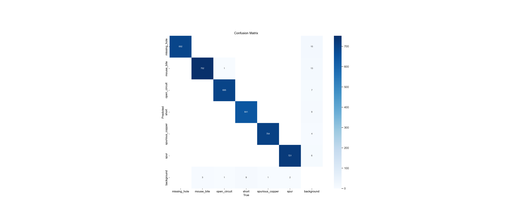
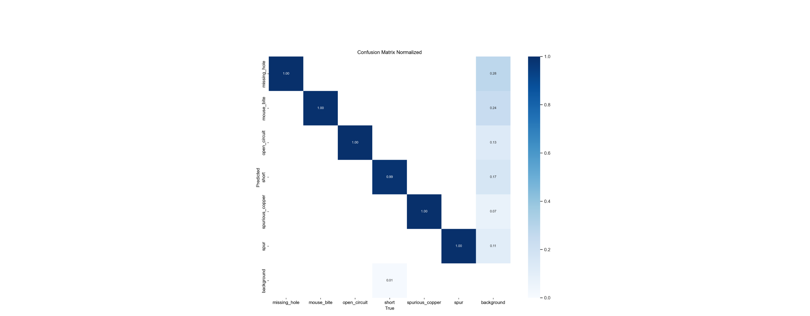
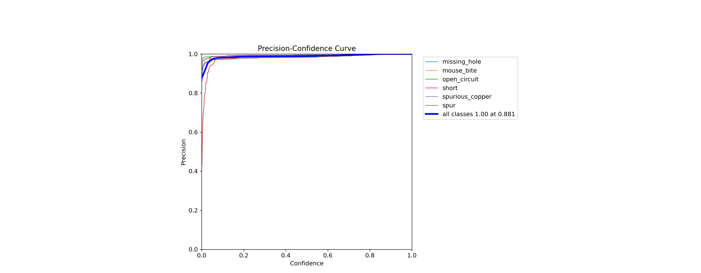
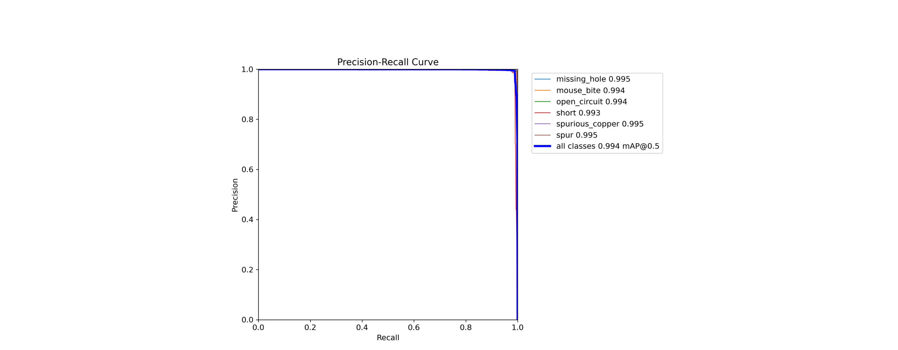

# Results of experiment 6

In this experiment, the YOLOv8s model was used.
Parameters set during training:
+ Number of epochs - 200
+ Batch size - 50
+ Image size - 608

[Link](https://app.clear.ml/projects/ad34b5d2036d44e7a0d10c6189ee8a59/experiments/4149c0a569d04dc0ad84e167cb69d515/output/execution) to the experiment in ClearML.

The graphs are shown below as training evaluations:

