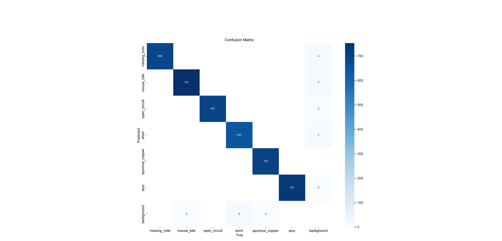
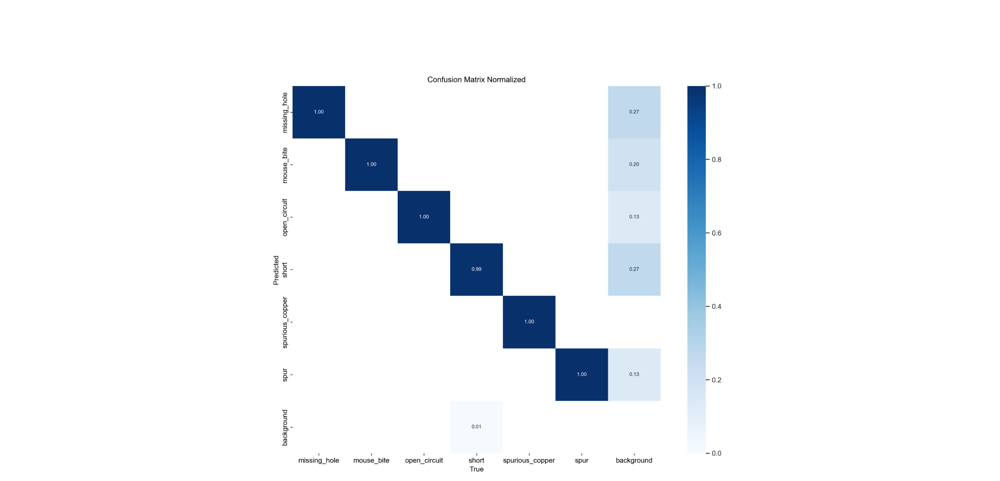
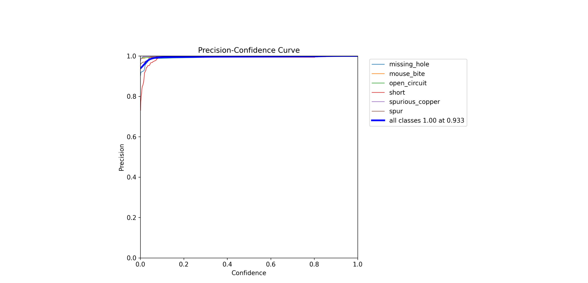
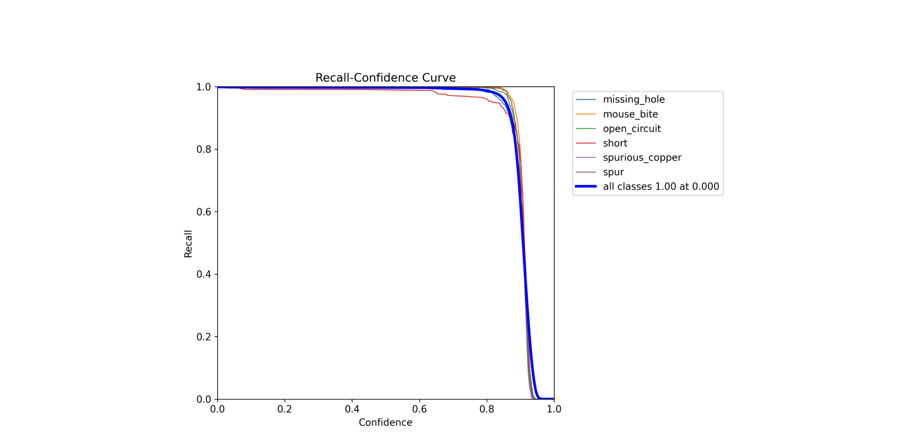
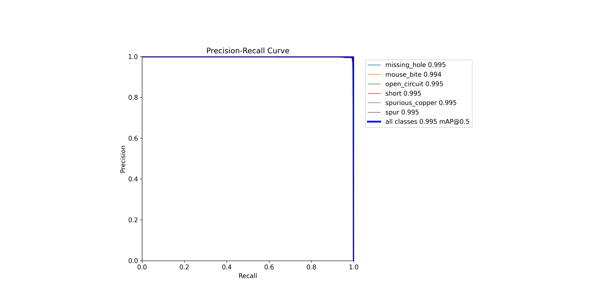
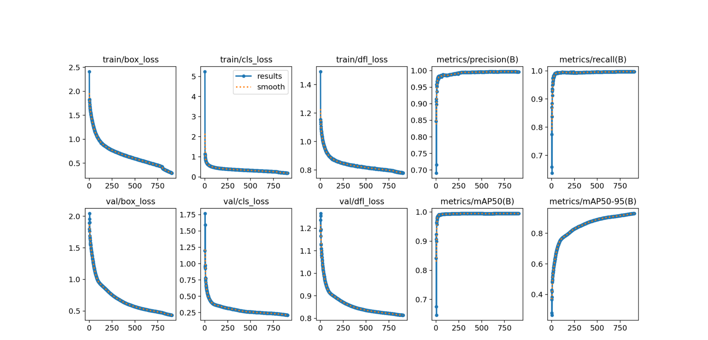

# Результаты эксперимента 8

В данном эксперименте использовалась модель YOLOv8s.
Параметры, заданные при обучении:
+  Количество эпох - 905
+  Размер батча - 50
+  Размер изображения - 608

[Ссылка](https://app.clear.ml/projects/ad34b5d2036d44e7a0d10c6189ee8a59/experiments/5ba714bcf87b44d6a274498b846b6ab5/output/execution) на эксперимент в ClearML.
Ниже в качестве оценок обучения приведены графики:

