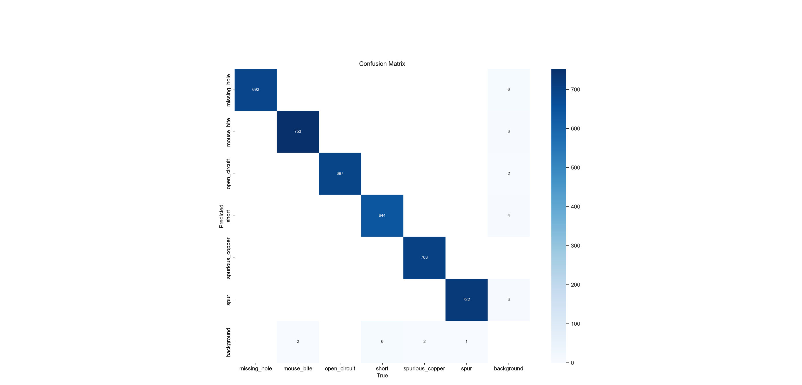
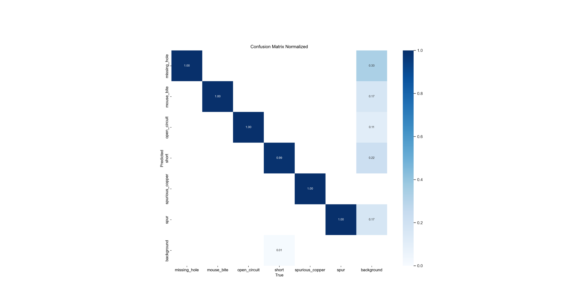
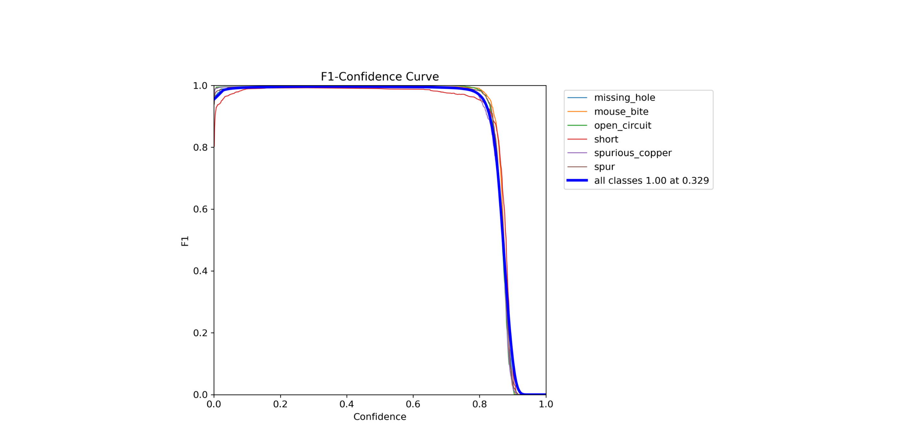
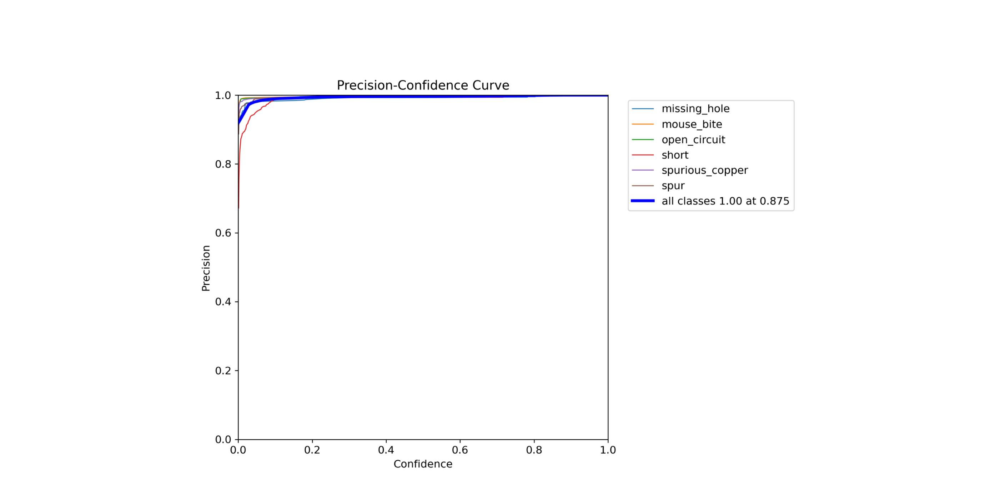
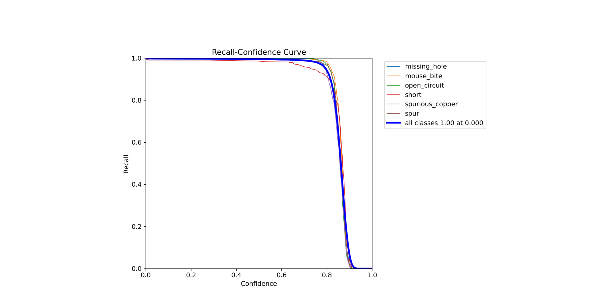
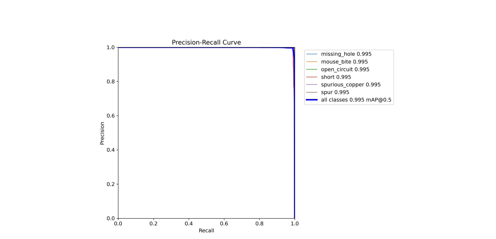
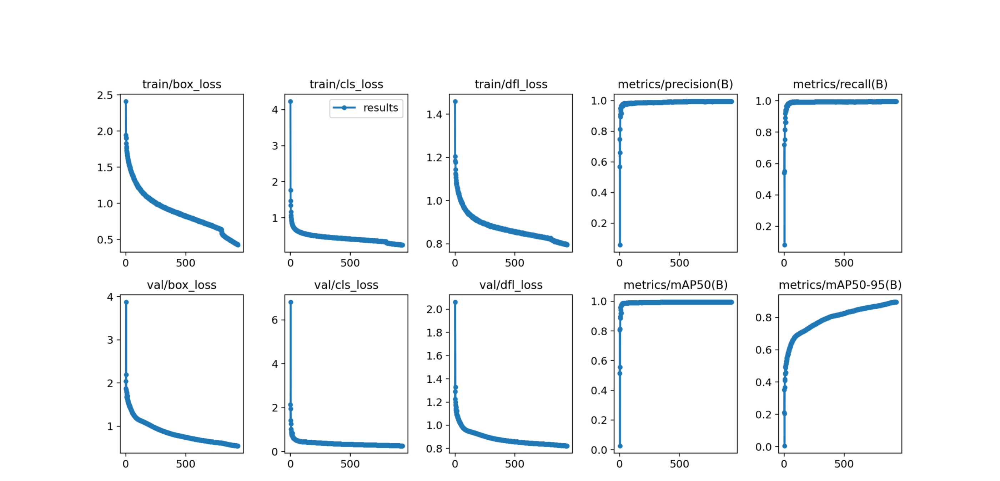

# Результаты эксперимента 9

В данном эксперименте использовалась модель YOLOv8n.
Параметры, заданные при обучении:
+  Количество эпох - 936
+  Размер батча - 50
+  Размер изображения - 608

[Ссылка](https://app.clear.ml/projects/ad34b5d2036d44e7a0d10c6189ee8a59/experiments/4d6d047e01fe4793b4a30c90b6cbca3a/output/execution) на эксперимент в ClearML.

Ниже в качестве оценок обучения приведены графики:

